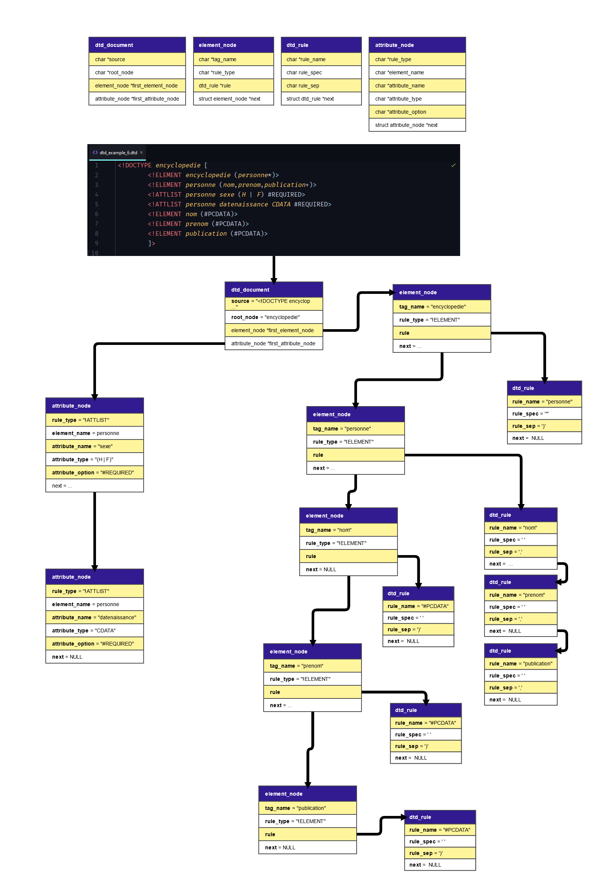

# CXML

|  |  |  |
| ------------------------------------------------------------ | ------------------------------------------------------------ | ------------------------------------------------------------ |
|||

**Table of contents :**

<!-- toc -->

- [Introduction](#introduction)
  * [Features](#features)
  * [Screenshots](#screenshots)
  * [XML Parsing tree](#xml-parsing-tree)
  * [DTD Parsing tree](#dtd-parsing-tree)
- [Develop](#develop)
  * [Dependencies](#dependencies)
  * [Environment](#environment)
  * [Setting up](#setting-up)
  * [Dependencies](#dependencies-1)
  * [Running](#running)
    + [Clion configuration](#clion-configuration)
- [Get final executable](#get-final-executable)
- [Final project report](#final-project-report)
- [Contributors](#contributors)

<!-- tocstop -->

# Introduction

XML DTD Validation written in C with GTK interface.

## Features

- Parse XML file and check syntax error
- Parse external DTD file and check some of syntax error (not all)
- Handle external DTD whit and without `!DOCTYPE`
- Validate XML file with the given DTD file. Only `element` and `attlist` rules are handled 

## Screenshots

Here is some captures of the program :

|            |  |
| :----------------------------------------------------: | :----------------------------------------------------------: |
|            |                  |
|  |        |

## XML Parsing tree

Here is a visual representation of how the program is parsing xml file in our structures :


## DTD Parsing tree

Here is a visual representation of how the program is parsing dtd file in our structures :



# Develop

If you want to develop on this project, you have to setup a GTK CMAKE compatible environment.

This program has been meant to be cross platform between Linux (Debian based) and Windows.

## Dependencies

- GTK 3 development library
- gcc-8

## Environment

- **Operating system :** Windows or Linux (wsl, ubuntu or other debian based distribution)
- **CMAKE version:** 3.16.3
- **C Standard :** C99

## Setting up

First of all, you have to Clone the project on MAIN branch.

## Dependencies 

To install all necessary dependencies on Linux, run with root privileges

```bash
install_dependencies.sh
```

If you are on Windows, you can follow this :baguette_bread: French guide to setup a Clion environment : https://github.com/Nouuu/GTK-Cours-et-TP

## Running

If you already know how to build cmake app, then good for you ! Otherwise follow this guide : https://cmake.org/runningcmake/

If you develop on Clion, you have nothing on this to do, it is already set up.

### Clion configuration

You must set clion run configuration as following if you want to run it directly from IDE :


# Get final executable

You can go here to download the final release executable (both Linux and Windows) :

https://github.com/Nouuu/CXML/releases

# Final project report

This our team project report :baguette_bread: that resume everything in that project.

 [XML_Rapport.pdf](XML_Rapport.pdf) 

# Contributors

|                                                     |                                                              |
| --------------------------------------------------- | ------------------------------------------------------------ |
| [Noé LARRIEU-LACOSTE](https://github.com/Nouuu)     |   |
| [Isaac OUSLIMANE](https://github.com/IsaacOus)      |  |
| [Audrey DI VITO](https://github.com/Audrey-DI-VITO) |  |
